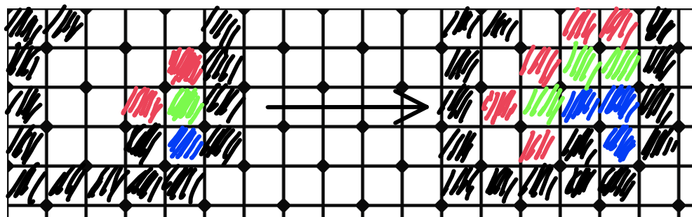

# Table of Contents
-  [Introduction](#introduction)
    -  [Background](#background)
-  [Usage](#usage)
    - [Building the Project](#building-the-project)
    - [Running the Application](#running-the-application)
    - [Seeing the Effects of OpenMP](#seeing-the-effects-of-openmp)
-  [Architecture](#architecture)
-  [Conclusion](#conclusion)

# Introduction
This is a teaching material aimed to demonstrate the powerfulness of the declarative programming paradigm with OpenMP[^1]. The following topics are covered in this unit:

- How [OpenMP](https://www.openmp.org) may boost performance of a program with minimal extra effort in fully portable manner.
- In what sense [Amdahl's Law](https://en.wikipedia.org/wiki/Amdahl%27s_law) differs from [Gustafson's Law](https://en.wikipedia.org/wiki/Gustafson%27s_law).
- The basics of a [greedy programming paradigm](https://www.geeksforgeeks.org/greedy-algorithms/) in solving tough computational problems.
- The variant of the [flood-fill algorithm](https://en.wikipedia.org/wiki/Flood_fill) that optimizes the number of cells that will be explicitly flooded based on a given criteria.
- The [depth-first search graph algorithm](https://www.geeksforgeeks.org/depth-first-search-or-dfs-for-a-graph/) to estimate the problem's lower bound.
- How to apply randomization to introduce additional variability and avoid being stuck in a local optima.
- How data chunking helps in handling large grids.
- An example of a properly designed, well commented and structured C++ program.

## Background
To make the primer concrete this unit presents a solution to a competitive programming task (originally titled Мајнкрафт вООда in cyrillic) that appeared at the Serbian Informatics Olympiad contest in 2023. The starter kit was downloaded from the platform [Arena](https://arena.petlja.org/sr-Latn-RS/competition/2022-2023-sio-2-testiranje#tab_overview) (currently only in Serbian) maintained by the Mathematical Society of Serbia[^2]. The kit is fully integrated into this repository. You may read the problem description [here](problem-description.pdf) (in English).

There is an accompanying site [Olympicode](https://olympicode.rs/takprog/2022_2023/sio/05_vooda/) (currently only in Serbian) that shares some hints and partial solutions for this task. These were taken into account while developing the unified engine capable of handling all provided test cases and achieving a maximal score. Furthermore, this application employs OpenMP to reach an acceptable solution in a much shorter time compared to the sequential variant.

# Usage
The table below explains the directory structure of this repository.

| Folder      | Description                                                                       |
|-------------|-----------------------------------------------------------------------------------|
| *root*      | Contains the `Makefile` to build the project.                                     |
| `Inputs`    | Hosts the input files (for example, `01.in` is the input for the 1st test case).  |
| `Images`    | The visual rendering of inputs (used only to better understand each test case).   |
| `Solutions` | Contains the compressed output files (solutions) for test cases (like, `01.out`). |
| `Scoring`   | The scoring rules for test cases (like, `01-scoring.txt` for the 1st test case).  |
| `src`       | C++ source files (the `solver.cpp` is the main application file).                 |

> It is assumed that all commands below will be executed from the project's *root* folder as well as that this repo was cloned from GitHub and is available on your machine.

The `compressor.cpp` that is mentioned in the problem description is integrated into the main application file `solver.cpp`.

## Building the Project
All artifacts belonging to the build phase will be placed inside the `build` sub-folder. There are two `build` targets inside the `Makefile`[^3] as follows:

- `build-sequential`: builds the sequential version of the application.
- `build-parallel`: builds the parallel version of the application.

To clean up the project execute `make clean`.

Here is an example of building the sequential version of this program:

```
> make build-sequential 
mkdir -p build
g++ -Wall -std=c++14 -O3 -o build/solver src/solver.cpp
```

> Notice that you should always turn on compiler code optimizations, since a modern compiler can leverage low-level hardware supported parallelization on-the-fly.

## Running the Application
There are two `run` targets inside the `Makefile` as follows:

- `run` : runs the sequential/parallel version of the application in regular mode.
- `run-fast` : runs the sequential/parallel version of the application in fast mode.

The *fast* mode is useful to producing good enough solutions in a very short time frame. Interestingly, the 4th test case's optimal solution can only be achieved in this mode, partially due to its very special structure (overlapping rectangles). For larger grids you may want to use the *regular* mode. They differ in their heuristic functions used by the greedy algorithm for choosing the next move. See the section about the [architecture](#architecture) for more details, or simply peek into the source code.

Here is the dump of the terminal window after executing the program using the 1st test case and outputting the result onto the console:

```
> make run < Inputs/01.in
Engine mode is set to regular
Executing with max. 1 thread(s)
The estimated lower bound is 27
28
2 3 3 2 1 3 3 5 8 4 7 4 3 2 4 2 6 3 2 2 2 9 2 2 2 2 7 5 
<==================>
27
2 3 3 2 1 6 5 2 5 6 8 4 2 5 2 4 2 5 2 2 4 7 2 2 9 3 2 
<==================>
The optimal solution has been found.
```

Notice that each solution is separated with the `<==================>` divider. The program will run continuously until it reaches the estimated lower bound. This is only attainable in a reasonable amount of time for the first 4 test cases. Nonetheless, the scoring rules are relaxed for more complex test cases, so you should only wait until some result is generated that would gain you the maximal number of points. To break the program just pres Control+C.

You may want to redirect the output to a file (see the example below), which is beneficial when the input grid is huge. At any rate, you will need to redact the output for submission purposes, by only keeping the part relevant for submission. With an output redirected to a file you may need to peek into the content using the `head` or `tail` commands from a second terminal window.

As this is an *output only* task, meaning that you only submit the output generated by your program, you have plenty of time to run it while working on other tasks. The most difficult test case (the 8th one) demands about 16 minutes, whilst the 7th is finished in approximately 5 minutes on a MacBook Pro with an 2,6 GHz 6-Core Intel Core i7 processor and 16 GB 2667 MHz DDR4 memory. These figures are for the sequential version executing in regular regime. Here is an example session (note the usage of the `time` utility) that was manually interrupted after seeing a good enough solution in the output file:

```
> time make run < Inputs/08.in > Solutions/08.out 
^Cmake: *** [run] Interrupt: 2

make run < Inputs/08.in > Solutions/08.out  972.71s user 3.11s system 99% cpu 16:20.39 total
```

> As an additional exercise you can introduce an extra input (or configuration) parameter called `threshold` that would stop the program after reaching the desired value. You may want to set it according to your scoring criteria.

## Seeing the Effects of OpenMP
To trigger parallel execution make sure to run `make build-parallel` and check whether the number of threads utilized by OpenMP is OK on your machine (see the environment variable `OMP_NUM_THREADS` inside the `Makefile`). Here is the dump from the session solving the most complex test case:

```
> time make run < Inputs/08.in > Solutions/08.out
^Cmake: *** [run] Interrupt: 2

make run < Inputs/08.in > Solutions/08.out  1874.81s user 6.89s system 569% cpu 5:30.56 total
```

As you can see, it has completed the task, by generating a solution earning maximum points, in about 5 instead of 16 minutes. Such ~3x speedup was achieved by only adding couple of `#pragma` statements to the code. This serves as the perfect testimony for the power of the declarative parallel programming approach. Furthermore, the same source code can be run in unchanged fashion sequentially by just omitting the compiler instructions associated with OpenMP.

> Albeit being a simple thing to add OpenMP directives to your sequential code, you still need to design a proper parallel program. Here, the *chunking technique* was applied to produce data subdomains amenable for loop parallelization. The beauty of OpenMP is that you can incrementally adorn your sequential program with additional directives and make changes to it, as dictated by performance figures. At one point, there is no need to further improve speed.

This case study illuminates the essence of two crucial laws in distributed computing:

- [Amdahl's Law](https://en.wikipedia.org/wiki/Amdahl%27s_law) which says how much speedup is possible for the same amount of work. In our case, the 8th test case was finished ~3x faster.
- [Gustafson's Law](https://en.wikipedia.org/wiki/Gustafson%27s_law) which tells how much more work can be done in the same amount of time. Recall that we have spent around 5 minutes for both the 7th and 8th test cases. We have managed to scale 9x our data set and accomplish the task in the same amount of time. The 9x factor is due to increasing the grid from 1000x1000 to 3000x3000. Consequently, this is the reason why this law is more relevant than the previous one.

### Reproducibility of Runs
Observe that the random number generator is seeded with a fixed value (see the beginning of the `solver.cpp` file). This is done to ensure that the program will produce the same output for the same input. This is crucial for the reproducibility of the runs and useful if you want to experiment with the program and compare the results.

Nonetheless, due to parallelism the program may produce slightly different results for the same input, since the order of the chunks being flooded is not deterministic. As randomization does have an impact of the outcome the exact shuffling of cells inside a chunk matters. Of course, when run in sequential mode the program will always produce the same output for the same input.

Additionally, execution times will surely vary depending on numerous factors including the current load of a system. The figures provided in this document are only indicative. What really counts is their relative values for determining speedup. 

# Architecture
The source code is extensively documented, so it serves as a primary guide in understanding the solution. The basic strategy is quite straightforward:

1. First, we put all available cells for flooding into a list and sort them based on their degrees of freedom (how many neighbors are also available). This is important since each starting cell for a new connected components of a grid should be picked based on these degrees of freedom. Border cells are mostly flooded, so we try to pick cells with larger number of walls around them.
2. We always flood cells from the backlog with at least 3 surrounding walls (including border walls).
3. If we need to start a new connected component, then we do this as depicted above.
4. We all the time track the number of flooded neighbors for each cell.
5. Each time we flood a cell we also put into a queue all cells that will be also flooded according to the rules. Furthermore, we register candidate cells serving as pivots in searching for the next cell to flood in subsequent iterations. Essentially, candidate cells are marking the horizon over which we search and expand a flooded region.
6. Based on the execution regime we use different heuristics (these are well commented in the code) for evaluating candidates.
7. If the grid is large, then we break it up into chunks and process them independently. Partial results are aggregated at the end.

The next diagram illustrates the progress over time for some region of a grid.[^4]

<kbd></kbd>

A new connected component on the left is seeded with a cell that is surrounded by 3 walls (flooded cells are blue and walls are black). We know for sure that it must be flooded explicitly. The green cells mark the candidates (pivots) over which we seek for the best cell to flood next. Notice that a green candidate itself is never good cell to flood, since by flooding any it's available neighbor it will be automatically flooded, too. Of course, if we have no other option, then we would need to flood it, but we try not to.

The red cells are those that will be evaluated, and we will pick one to flood. The state of the grid on the right shows what happens if we decide to flood one of the red cells on the left. This process continues until we run out of candidates. In that case we pick the next cell from the global backlog. It could be a cell from the current component, if we cannot find a good neighbor for a green cell to trigger its flooding, though.

# Conclusion
This project demonstrates the importance and usefulness of knowing ways to easily employ parallel programming concepts. OpenMP is an ultimate choice for gaining high performance without a need to tackle low-level constructs (like, working with various threading libraries). This project also highlights an area where OpenMP and utilization of parallel programming may shine, namely, the *output only* competitive programming tasks. Finding a solution in much less time means more chances to experiment with the program and more opportunities to collect points.

[^1]: The best introductory book on OpenMP is [Using OpenMP](https://mitpress.mit.edu/9780262533027/) despite talking about an old 2.5 version.
[^2]: You can create a free account if you would like to use the platform and submit your solutions. There is also a portal called [Petlja](https://petlja.org/en) with some content available in English, too.
[^3]: The `Makefile` of this project is set up to work on macOS, so you may need to tweak the `CC` and `OPENMP_LIB` definitions, if you want to use OpenMP.
[^4]: The background grid was taken from [here](https://pixabay.com/vectors/mesh-pattern-monochrome-geometric-2697073/).